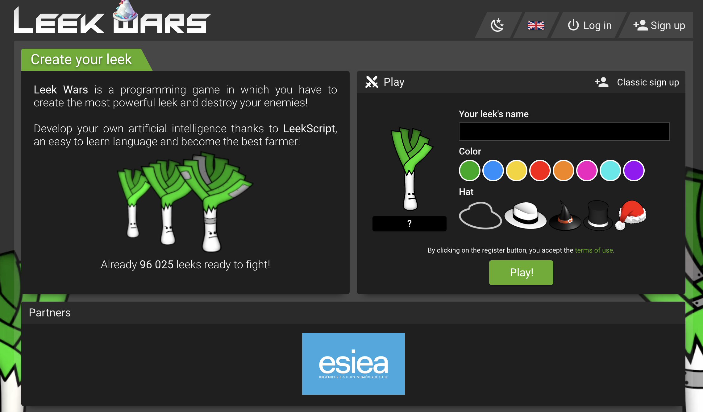

# LeekWars

LeekWars est un site Internet dans lequel il est possible de faire combattre des poireaux (oui oui, des poireaux) entre eux. Le but est de faire progresser ses poireaux en les faisant combattre contre d'autres poireaux, et ainsi devenir le meilleur poireau de tous les temps.

Dans LeekWars, il n'existe pas de contrôles. Le joueur ne joue pas, il programme son poireau pour que celui-ci soit complètement autonome.

Faisons nos premiers pas dans l'intelligence artificielle ensemble à l'aide de LeekWars !

> :rocket: Cette activité est encadrée par le Coding Club d'Epitech.  :question: Si vous avez des questions ou que vous bloquez sur l'une des étapes, vous pouvez demander de l'aide aux autres participants autour de vous (l'entraide est primordiale à Epitech :slight_smile:). S'ils ne parviennent pas à vous débloquer, n'hésitez pas à appeler un *Cobra*, identifiables à l'aide de leurs super polos :star:

## Etape 0 : Créons notre premier poireau

Rendez-vous sur le site de [LeekWars](https://leekwars.com/).

Vous devriez arriver sur une page qui ressemble à celle-ci :

> :bulb: Vous pouvez mettre LeekWars en français en cliquant sur le drapeau.

Cliquez sur le bouton "S'inscrire" (ou `Sign Up`) en haut à droite de la page.

Renseignez ensuite le nom de votre poireau, et ajoutez des éléments de personnalisation à votre guise. Vous pouvez par exemple changer la couleur des feuilles de votre poireau et lui ajouter un chapeau :tophat:

## Etape 1 : Jettons un oeil à l'interface

TODO: Décrire l'interface et les différents boutons.

Référencer la doc et les différents onglets (programmes, combats, market...)

Expliquer dès maintenant le système de niveau et de stats, parce que chaque montée de niveau permet de monter une stat

## Etape 2 : Lançons nos premiers combats

TODO: Décrire comment lancer un combat, comment le regarder

Expliquer le système de points par tour

Expliquer l'intérêt de regarder les combats pour améliorer son IA

Finir la partie avec les récompenses du combat et un encouragement à améliorer son programme

## Etape 3 : Modifions le programme de notre poireau

TODO: Donner une première piste d'amélioration en guidant vers une première solution

Expliquer les concepts basiques de la programmation (variables, conditions, boucles...) en rappelant que les Cobra sont là pour aider

## Etape 4 : Montée de niveau rime avec nouveaux pouvoirs !

TODO: Expliquer les différents items du market et leur pertinence: armes avec différentes range/damage/fire, potions avec différents effets et chips

Expliquer leur intégration dans le code

## Etape 5 : Améliorons notre IA

TODO: Farmer les combats pour acquérir plus de niveau

Expliquer différentes stratégies possibles (distance, tank, heal, etc.)

## Etape 6 : L'étape 6

Félicitations, vous avez désormais toutes les bases nécessaires pour jouer à LeekWars !

Le plus important pour vous à partir de maintenant sera d'avoir un poireau qui saura faire face à tout type de situation loufoque et d'agir en conséquence.

N'oubliez pas : plus vous combattrez, plus vous monterez en rang, et plus vous affronterez des adversaires coriaces. Ajustez votre stratégie en permanence pour triompher de vos ennemis !

> Désormais, la [documentation](https://leekwars.com/help/documentation) devient votre meilleure amie :wink:

## Et si on faisait un tournoi ?

TODO: Expliquer le principe des tournois

Expliquer le principe des équipes

On fera un tournoi en fin de journée (voir si c'est possible de faire un tournoi privé)
