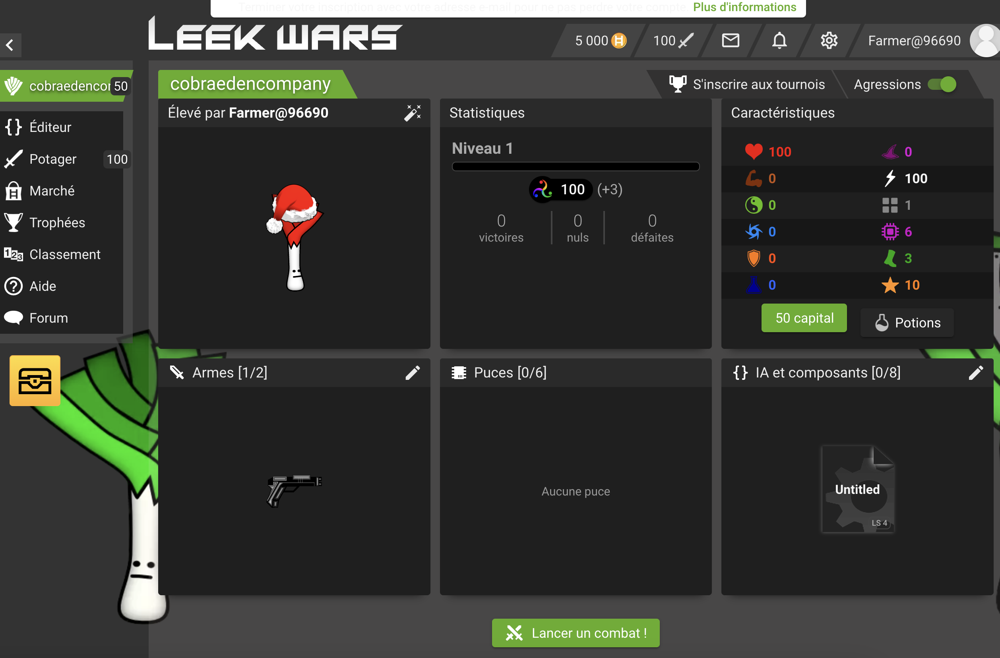
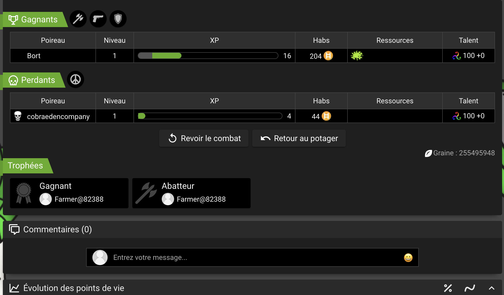
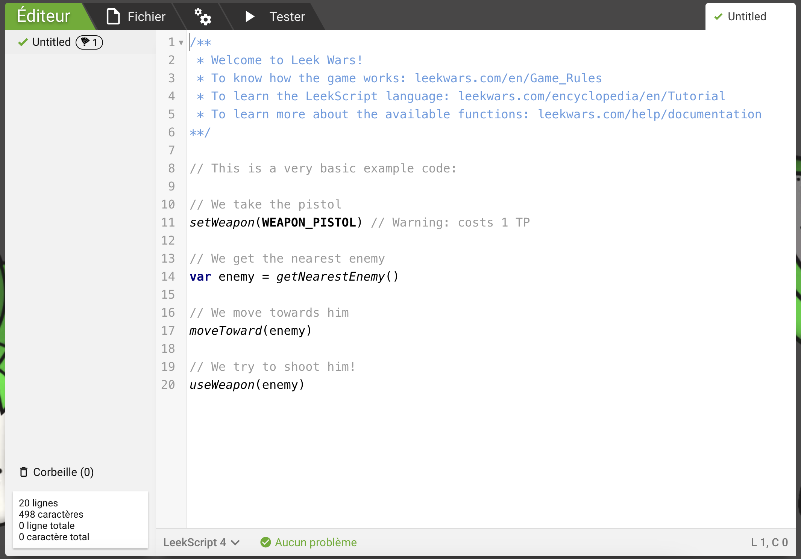

# LeekWars

LeekWars est un site Internet dans lequel il est possible de faire combattre des poireaux (oui oui, des poireaux) entre eux. Le but est de faire progresser ses poireaux en les faisant combattre contre d'autres poireaux, et ainsi devenir le meilleur poireau de tous les temps.

Dans LeekWars, il n'existe pas de contrôles. Le joueur ne joue pas, il programme son poireau pour que celui-ci soit complètement autonome.

Faisons nos premiers pas dans l'intelligence artificielle ensemble à l'aide de LeekWars !

> 🚀 Cette activité est encadrée par le Coding Club d'Epitech.\
> ❓ Si vous avez des questions ou que vous bloquez sur l'une des étapes, vous pouvez demander de l'aide aux autres participants autour de vous (l'entraide est primordiale à Epitech 😄).\
> S'ils ne parviennent pas à vous débloquer, n'hésitez pas à appeler un *Cobra*, identifiables à l'aide de leurs super polos ⭐ (ou pas... ça dépendra !)

## Étape 0 : Créons notre premier poireau

Rendez-vous sur le site de [LeekWars](https://leekwars.com/).

Vous devriez arriver sur une page qui ressemble à celle-ci :

> 💡 Vous pouvez mettre LeekWars en français en cliquant sur le drapeau.

Cliquez sur le bouton "S'inscrire" (ou `Sign Up`) en haut à droite de la page.

Renseignez ensuite le nom de votre poireau, et ajoutez des éléments de personnalisation à votre guise. Vous pouvez par exemple changer la couleur des feuilles de votre poireau et lui ajouter un chapeau 🎩

## Étape 1 : Jetons un oeil à l'interface

Nous voici désormais sur une magnifique interface ! Voyons voir ce qu'on a là...

En haut à droite de l'écran, nous avons diverses informations utiles.

- En premier lieu, nous voyons notre monnaie : cette ressource sera très utile pour améliorer son poireau par la suite ! Elle s'acquiert en gagnant des combats.
- A coté de la monnaie, nous voyons notre rang. Il s'agit d'un score qui augmente à chaque fois que votre poireau gagne un combat, et qui diminue à chaque fois qu'il en perd un. Plus votre rang est élevé, plus vous affronterez des adversaires coriaces. 

> 💡 Cela s'apparente à un système de `MMR` ! Vous pouvez en apprendre plus [ici](https://hitmarker.net/what-does-mmr-mean#:~:text=Matchmaking%20Rating%2C%20or%20'MMR',and%20achieved%20a%20minimum%20MMR).

- Les deux icônes à droite sont la boite aux lettres et les notifications, et l'icone à gauche permet d'accéder aux paramètres.
- Enfin, le bouton `Profil` permet d'accéder à votre page de profil, où vous pouvez ajouter différentes informations sur vous-même.

### Passons au centre de l'écran !

Au centre de l'écran, nous pouvons retrouver une synthèse de notre poireau et de nos statistiques, mais nous pouvons également les améliorer !

Nous voyons également notre inventaire : nous possédons actuellement une arme, notre bon vieux `pistolet` ! 🔫

Enfin, à gauche de l'écran, il existe différents boutons : `Editeur`, `Potager` et `Marché` sont les plus importants et sont ceux dans lesquels vous passerez le plus de temps 😄

> 💡 Nous vous conseillons de visiter les différentes pages du jeu pour vous familiariser avec l'interface. Vous y découvrirez peut-être déjà quelques fonctionnalités de LeekWars que nous n'avons pas encore expliqué...

⚠️ Nous sommes brièvement passés sur le système de statistiques sans plus de détails.

Pour faire court, votre poireau possède un niveau (il commence au niveau 1), et chaque montée de niveau lui donne un **point de capital**. Vous pouvez investir chaque point de capital dans une statistique, permettant d'augmenter différentes stats telles que sa vie, sa puissance, sa vitesse mais encore différents aspects "programmatiques" tels que la quantité de mémoire à votre disposition, ou encore la quantité d'opérations informatiques disponibles à chaque tour pendant le combat.

> 🚀 Vous disposez de 50 points de capital. Vous pouvez les investir dès maintenant, mais nous vous recommandons de continuer à découvrir le jeu avant de les utiliser, afin de savoir quelles statistiques vous souhaitez améliorer en priorité.

Assez lu ? Ca tombe bien, tous dans le ring maintenant !

## Étape 2 : Lançons nos premiers combats

Passons sans plus tarder aux combats, ce pourquoi nous sommes tous ici (et la programmation aussi, évidemment. Mais surtout les combats) ⚔️

Rendez vous dans la section `Potager`. Vous devriez voir apparaitre votre poireau, ainsi que d'autres poireaux en dessous de celui-ci. Ce sont vos adversaires ! Cliquez sur n'importe lequel d'entre eux pour lancer un combat !

Une fenêtre s'ouvre alors. Vous pouvez observer le combat entre vous et votre adversaire.

> 💡 Vous avez accès à différentes informations sur cet écran, en plus de voir le combat. Cela pourra vous être très utile lorsque vous commencerez à améliorer le programme de votre poireau !

Tour à tour, nous voyons les actions de notre poireau et de celui de notre ennemi s'effectuer : on voit qu'ils se rapprochent jusqu'à être à une distance assez proche, puis s'échangent des coups jusqu'à ce que mort s'en suive.

Vous avez gagné ? Félicitations ! 🏆 \
Vous avez perdu ? Dommage... 😢

Ce que ce combat vous a surtout appris, c'est une nouvelle notion du jeu : le mouvement et les actions.

> 💡 De base, votre poireau possède 3 points de mouvement et 10 points d'action. \
> Cela signifie qu'il peut se déplacer de 3 cases par tour, et effectuer des actions valant un total de 10 points maximum. Chaque action possède son nombre de points requis !

Il est très important d'**observer** le comportement de votre poireau : cela vous aidera à comprendre son comportement. 

Lorsqu'une situation ne se passe pas comme prévu, vous pourrez vous baser sur ce que vous avez vu pour essayer de déterminer le problème (indice : il viendra très certainement de votre code 🤔)

En plus de l'évolution de votre rang, votre combat vous octroie différentes récompenses, et ce même si vous perdez. Ne vous inquiétez pas, ce premier combat vous est bénéfique même si vous ne l'avez pas gagné. 😉

Jetons un oeil à l'interface suivant :

J'ai perdu 😢 mais cela ne m'a pas empêhé de gagner des Habs, la monnaie dont on parlait tout à l'heure ! 💵

En revanche, mon poireau n'a pas gagné beaucoup d'expérience. Il faudra gagner le combat pour cela !

> 🏆 J'ai également gagné des trophées. Ces derniers sont des succès que vous pouvez gagner en accomplissant différentes actions dans le jeu. \
> Leur utilité principale ? Aucune, si ce n'est le **flex** bien sûr !

Aucune, vraiment ? Lorsque vous revenez sur votre profil, regardez en bas à gauche si vous ne voyez pas une icône de coffre. Ces trophées, ou d'autres accomplissements que vous effectuez pourraient vous octroyer de savoureuses récompenses... 🎁

Nous pourrions nous amuser à lancer des combats en boucle de la sorte, jusqu'à ce que notre poireau finisse par gagner ou monter de niveau. Mais on ne vous conseille pas de faire cela sans toucher au **programme** de votre poireau, et ce pour deux raisons :

- Même si vous gagnez les premiers combats, vous allez vite vous mesurer à des poireaux dont les programmes ont été modifiés. Et n'oubliez pas : le premier challenge est de réussir à contrer la stratégie de base de votre poireau, c'est donc ce sur quoi seront spécialisés vos adversaires ! Coriace...
- Vous n'avez droit qu'à **100 combats**. Cette limite se régénère avec le temps (ou en achetant avec vos *Habs*), mais ce seront peut-être vos seuls combats de la journée, ce serait dommage de les gaspiller !

Apprenons à triompher de nos ennemis avant de retourner dans le potager. Et pour cela, rentrons dans le vif du sujet : la **programmation** ! ❤️

## Étape 3 : Modifions le programme de notre poireau

Rendez-vous dans la section `Editeur`. Vous devriez voir une page qui ressemble à celle-ci :

Quel beau pâté d'instructions nous avons là !

Observons ce que nous avons là :

- Le code en bleu et en gris est ce que nous appelons en programmation des **commentaires**. Ce sont des lignes qui ne seront pas exécutées par le programme, mais qui permettent de donner des informations sur le code. Ici, on nous explique que le code est généré automatiquement, et qu'il s'agit d'un exemple très basique. A notre tour de le modifier.
- Les instructions en-dessous, aussi appelés **fonctions**, sont des représentations des différentes actions que va effectuer votre poireau. Par exemple, la fonction `moveToward` permet de se déplacer vers un ennemi, et la fonction `setWeapon` permet à votre poireau de changer d'arme.
- Nous retrouvons également une **variable**, créée à l'aide du mot `let`. Cette variable contient votre ennemi ! Lorsque vous la passez à `moveToward`, cela permet d'indiquer à votre poireau que vous souhaitez qu'il avance vers votre ennemi le plus proche.

> 💡 Vous pouvez passer votre souris sur les différentes fonctions et mot-clés afin d'obtenir plus d'informations, tels qu'une explication de la fonction ou d'indices vous permettant d'améliorer votre code. \
> Qui sait, peut-être que les créateurs du site ont pensé à tout, et qu'ils ont caché dans ces indices des astuces pour améliorer votre code...

:warning: Attention ! L'ensemble du code que vous avez sous les yeux est exécuté **entièrement** à chaque tour.

Vous vous souvenez quand je vous disais que vos vous pouviez améliorer la quantité d'actions informatiques à l'aide de vous statistiques ? Vous pourrez observer ici que chaque fonction possède un nombre d'actions requises. Vous devez pouvoir terminer votre tour sans arriver à court d'opérations, ou votre code s'arrêtera et ce sera immédiatement au tour de votre adversaire !

> Nous obtenons ici des liens très utiles, contenant différentes informations à propos des règles du jeu, du langage de programmation de LeekWars (le LeekScript ! 🍏) ainsi que des différentes fonctions que nous avons à notre disposition. \
> Vu que ces liens sont en anglais, voici leurs équivalents français ! :flag_fr: Ce sera sans doute plus simple comme ça 😉
> - [Découvrir le LeekScript](https://leekwars.com/encyclopedia/fr/Tutoriel)
> - [Documentation](https://leekwars.com/help/documentation)

:face_with_monocle: Le lien de découverte contient même des tutoriels, avec des quiz qui rapporteront un trophée si vous les terminez tous. Cela fait au moins trois raisons de cliquer sur ce lien !

Grâce à ces exercices, vous découvrirez les notions de base de la programmation : fonctions, boucles, variables... cela vous donnera un solide bagage sur lequel vous pourrez vous appuyer pour développer vos stratégies !

> 🐍 Une notion vous échappe ? Vous n'arrivez pas à comprendre un élément en particulier ou vous n'arrivez pas à le mettre en pratique ? Votre équipe de Cobras est toujours là pour vous aider 😄

Maintenant que nous avons toutes les clés en main, attaquons-nous à notre première tâche : améliorons un peu notre poireau.

Nous allons vous donner une première piste pour l'améliorer : actuellement, votre poireau se déplace vers l'ennemi si nécessaire, puis l'attaque avec son pistolet, mais **uniquement une fois par tour** !

C'est dommage, vous n'utilisez pas tous les **points d'action** de votre poireau. Et si vous pouviez attaquer plusieurs fois par tour ? 🤔

> 💡 Indice: vous pouvez utiliser une boucle pour répéter une action plusieurs fois. \
> A l'aide d'une variable et de la fonction [getTotalTP](https://leekwars.com/help/documentation/getTotalTP), vous pourriez établir un compteur pour savoir s'il vous reste suffisamment de points d'action pour attaquer à nouveau !

🔧 Pour éviter d'avoir à tester votre code face à un vrai ennemi et donc de perdre des points et des combats inutilement, vous pouvez utiliser la fonctionnalité `Tester` disponible dans l'éditeur, vous permettant de lancer un combat factice contre une IA pré-programmée. Cela vous permet de voir si votre code fonctionne correctement !

Une fois que tout est opérationnel, vous pouvez retourner dans l'arène et montrer à vos adversaires le pouvoir de la programmation ! 💻

Vous pouvez enchaîner quelques combats, profiter de vos victoires puis vous repentir et réfléchir à de nouvelles façons d'améliorer votre poireau. Et c'est dans cette optique que nous attaquons la prochaine étape !

## Étape 4 : Montée de niveau rime avec nouveaux pouvoirs ❤️‍🔥

TODO: Expliquer les différents items du market et leur pertinence: armes avec différentes range/damage/fire, potions avec différents effets et chips

Expliquer leur intégration dans le code

## Étape 5 : Améliorons notre IA 🧠

Avoir un poireau qui utilise différentes armes et puces c'est bien, avoir une stratégie c'est mieux !

Maintenant que vous comprennez les éléments principaux de LeekWars, essayez de mettre en place une stratégie qui éliminera tous vos adversaires 🔫

Voici quelques exemples, mais n'hésitez pas à élaborer votre propre méthode :
- Utiliser des puces de protection ([casque](https://leekwars.com/market/helmet), [mur](https://leekwars.com/market/wall)...) pour absorber des dégâts en foncant sur l'ennemi avec un [fusil à pompe](https://leekwars.com/market/shotgun) ou un [glaive](https://leekwars.com/market/broadsword) 🔪, qui font beaucoup de dégâts au corps à corps
- À l'inverse, jouer sur la longue distance en tirant sur l'ennemi puis en s'éloignant le plus possible (avec une puce comme les [bottes de cuir](https://leekwars.com/market/leather_boots) 👢 et des caractéritiques avec beaucoup de points de mouvement, il ne pourra peut-être pas vous rattraper 🏃)
- Gardez une statégie simple, mais posez vous les bonnes questions pour effectuer vos actions et notamment pour activer vos puces:
  - Est-ce nécessaire de se soigner si il ne vous reste pas beaucoup de points de vie (le poireau adverse vous tuera au prochain tour de toute facon) alors que vous pourriez prendre des [protéines](https://leekwars.com/market/protein) et tenter de porter un dernier coup létal à l'ennemi ?
  - Pourquoi se protéger des dégâts avec le [casque](https://leekwars.com/market/helmet) 🪖 si l'ennemi n'est pas suffisamment proche de vous pour vous toucher ?
  - Utilisez le terrain à votre avantage ! Si vous avez des puces de combat comme la [décharge électrique](https://leekwars.com/market/shock), elles sont activables même à travers les obstables, alors essayez de vous cacher des tirs adverses tout en faisant des dégâts avec vos puces 🔥

Evidemment, il est impossible d'activer toutes ces stratégies à la fois. Cela demanderait trop d'actions, et vous ne pouvez pas équiper une quantité infinie d'armes ou de puces.

Ce que vous pouvez faire, en revanche, est de déterminer quel style de jeu est celui qui vous plait le plus, ou quel est celui avec lesquels vous avez de meilleurs résultats, et essayer d'anticiper au maximum les stratégies que pourraient avoir vos ennemis et la réponse de votre poireau à ces dernières !

## Étape 6 : L'étape 6️⃣

Félicitations, vous avez désormais toutes les bases nécessaires pour jouer à LeekWars 🥳

Le plus important pour vous à partir de maintenant sera d'avoir un poireau qui saura faire face à tout type de situation loufoque et d'agir en conséquence.

N'oubliez pas : plus vous combattrez, plus vous monterez en rang, et plus vous affronterez des adversaires coriaces. Ajustez votre stratégie en permanence pour triompher de vos ennemis !

> Désormais, la [documentation](https://leekwars.com/help/documentation) devient votre meilleure amie 😉

## Et si on faisait un tournoi ? 🏆

Quoi de mieux qu'un petit tournoi pour vous départager et élire le meilleur éleveur de poireau de ce Coding Club 🔥

Regroupez-vous avec les personnes proches de vous pour créer une équipe (une personne peut le faire sur son profil, puis les autres peuvent la rejoindre en cliquant sur un lien similaire à celui-ci: [https://leekwars.com/team/8740](https://leekwars.com/team/8740), en remplacant l'ID par celui de votre équipe).

Désormais, attendez qu'un Cobra prépare la liste des équipes qui s'affronteront dans le tournoi 😄

> Vous pouvez peaufiner votre statégie pour prendre en compte les combats d'équipe, qui ont une particularité : chaque équipe possède une [tourelle](https://leekwars.com/encyclopedia/fr/Tourelles) sur le champ de bataille.

> Attention, celle-ci a beaucoup de points de vie, mais si vous arrivez à la détruire, vous gagnez 🎖️\
> Vous pouvez également gagner en tuant tous les poireaux adverses, comme sur les combats individuels.
